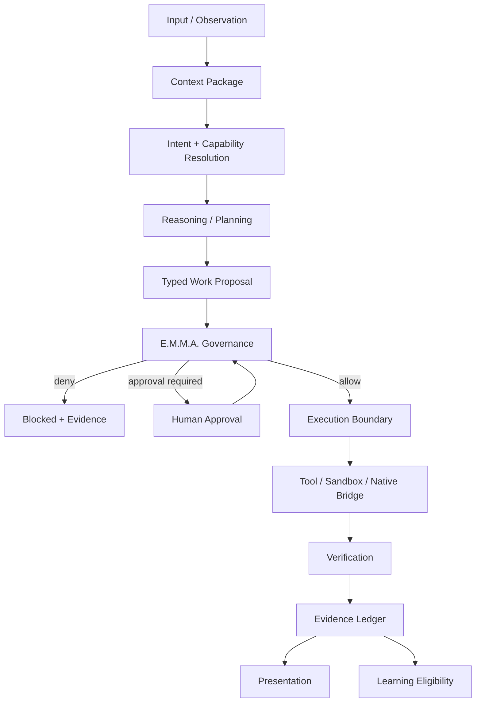

# Lucy AIOS — Public Architecture

## 1. Architectural objective

Lucy AIOS explores an owner-controlled AI operating architecture in which cognition, authority, execution, verification, and evidence are separate concerns.

The system is designed so that increasing model capability does not automatically increase runtime authority.

---

## 2. Core execution path

---

## 3. Major planes

### Cognitive plane

Responsible for understanding, reasoning, planning, retrieval, task context, competency selection, and specialist participation.

It may influence *what is proposed*.

It must not independently determine *what is authorized*.

### Authority plane

E.M.M.A. is the governance concept used to separate intelligence from permission.

The authority plane may consider:

- capability identity
- operation type
- subject / resource affected
- task identity
- origin of the request
- risk class
- approval state
- trust state
- applicable policy

The authority plane should remain stable even when the cognitive plane learns or changes.

### Execution plane

The execution plane performs allowed work through bounded interfaces such as:

- filesystem operations
- shell execution
- hardware telemetry
- application control
- browser automation
- sandboxed jobs
- simulation interfaces

Execution is not evidence by itself.

### Verification plane

Verification asks whether the intended post-condition occurred.

Examples:

- Was a file actually created?
- Is the process actually stopped?
- Did the external operation return the expected object?
- Did the simulated job complete under the requested constraints?

### Evidence plane

Lucy uses the E.M.M.A. evidence concept to preserve an inspectable record of decisions and outcomes.

The project intentionally treats:

- requested
- proposed
- approved
- executed
- verified
- recorded

as different states.

---

## 4. Agent boundary

Lucy is designed around **one governed Lucy** rather than a swarm of equal independent executors.

Specialists may:

- research
- propose
- analyze
- draft
- test
- simulate
- code
- critique

They should not:

- silently grant themselves authority
- write durable memory as an ungoverned side effect
- bypass Lucy to communicate hidden state to another agent
- become independent roots of trust

A specialist's output is input to Lucy's governed process.

---

## 5. Context identity

A serious multi-agent system needs to know *which task* a piece of context belongs to.

Lucy work includes carrying task and mode identity through language ingress, semantic resolution, context queries, and governed-run correlation.

This is intended to reduce:

- context leakage between tasks
- ambiguous referents
- cross-agent state confusion
- orphaned execution evidence

---

## 6. Cognitive resource fabric

Lucy research includes resource-aware cognition: the idea that task planning should account for machine resources rather than assuming unlimited compute.

Examples include:

- model selection
- workload arbitration
- memory pressure
- latency
- GPU / CPU availability
- execution eligibility
- measured provider provenance

The goal is not merely to select a model, but to make compute allocation part of the system's operating logic.

---

## 7. Competency and professional profiles

Lucy is being designed so that domains can carry structured competencies, handbooks, quality gates, and professional rules without turning the central reasoning layer into one giant monolith.

A competency can help determine:

- what knowledge is relevant
- which specialist should participate
- which quality gates apply
- what evidence should be produced

Competency does not equal authority.

---

## 8. World and simulation layer

Lucy research also includes:

- World Studio concepts
- OpenUSD scene description
- NVIDIA Omniverse / Earth-2 foundations
- Earth observation ingestion
- planetary-boundary data
- prediction and simulation ledgers
- historical context for anomaly detection

Observed, predicted, and simulated data should remain distinguishable.

---

## 9. Security model

Security work includes:

- governed sandbox execution
- explicit capability boundaries
- observer / telemetry concepts
- prompt-boundary monitoring
- approval gates
- local-first data handling
- evidence and provenance

See [`SECURITY.md`](SECURITY.md).

---

## 10. Architectural invariant

The shortest description of Lucy's design is:

> **Intelligence proposes. Governance authorizes. Execution acts. Verification proves. Evidence remembers.**
