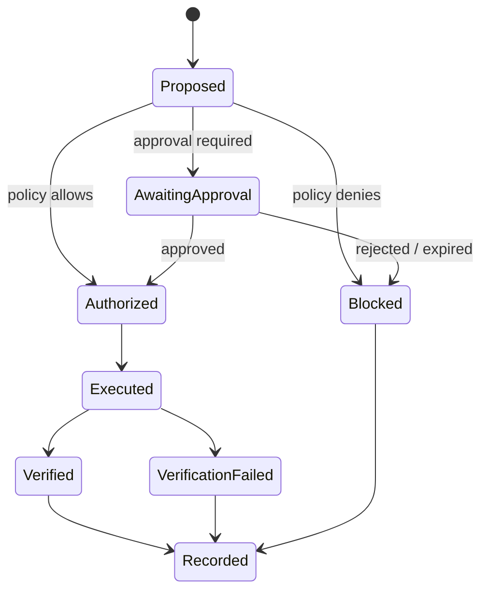

# E.M.M.A. Governance — Public Overview

## Enhanced Machine Mind Architecture

E.M.M.A. is Lucy AIOS's governance concept for keeping machine authority separate from model intelligence.

The public description intentionally focuses on contracts and invariants rather than disclosing every private implementation detail.

---

## The problem

A capable model can:

- produce persuasive plans
- call tools
- write code
- imitate confidence
- learn preferences
- coordinate specialists

None of those capabilities should automatically grant it authority over the machine.

---

## Core rule

> **Knowledge may influence proposals. It may not silently create permission.**

A learned preference such as "use PowerShell" may affect how Lucy prepares work.

It should not grant permission to terminate processes, write files, send messages, or modify production code.

---

## Governance lifecycle

---

## Design expectations

### Explicit capability identity
Governance should evaluate a concrete operation, not an abstract promise.

### Invocation-level judgment
A tool may be safe in one invocation and dangerous in another.

### Expiring authority
Authorization should be scoped and time-bounded where appropriate.

### Human-readable approval
When human approval is required, the user should be able to understand what is being approved.

### Evidence
Governance decisions should leave inspectable evidence.

### No agent privilege escalation
Specialist agents should not be able to transform expertise into runtime authority.

---

## Trust states

Lucy research has used bounded trust-state concepts such as:

- **SAFE**
- **PARTNER**
- **SOVEREIGN**

These are governance concepts, not personality labels.

A trust state should never mean "the AI may now ignore the owner."

---

## Approval is not verification

Approval answers:

> May this action be attempted?

Verification answers:

> Did the intended result actually occur?

They are different gates.

---

## Memory boundary

Durable personal understanding can make Lucy more useful.

It can also create a dangerous design failure if learned context changes permission.

Therefore:

> **Memory may change behavioral context. Memory may not change authority.**

This is one of the project's central invariants.

---

## Responsible disclosure

If you identify a path that appears capable of bypassing governance, do not publish a working exploit in a public issue.

See [`SECURITY.md`](SECURITY.md).
