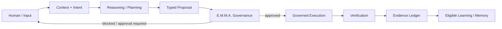

# Lucy AIOS

## A sovereign, local-first AI operating architecture

**Lucy AIOS is an experimental personal AI operating architecture designed around a simple rule: intelligence may adapt, but authority must remain governed.**

Lucy is not intended to be a chatbot with more tools. The project explores what happens when local AI reasoning, memory, agents, machine control, simulation, resource management, verification, and evidence are treated as parts of one governed operating system.

> **Observe → Understand → Propose → Govern → Execute → Verify → Record**

This repository is the **public front door** for Lucy AIOS. It contains architecture documentation, proof-of-concept material, public research, demonstrations, and contribution guidance.

The canonical Lucy AIOS development repository is private.

---

## Why Lucy exists

Most AI assistants are designed around a model that receives a request and returns an answer.

Lucy is being built around a different question:

> **How can an AI system become more capable over time without quietly becoming more powerful than its owner intended?**

Lucy separates:

- **Cognition** — what the system knows, reasons about, remembers, and proposes.
- **Authority** — what the system is permitted to do.
- **Execution** — what actually happens on the machine.
- **Verification** — whether the requested effect really occurred.
- **Evidence** — what can later be inspected and audited.

A core design invariant is:

> **Memory may change behavioral context. Memory may not change authority.**

---

## What makes Lucy different

### Local-first by design
Lucy is intended to keep private context and ordinary reasoning on owner-controlled hardware whenever practical.

### Governed execution
Tools and agents do not become independent authorities. Effectful actions pass through runtime governance before execution.

### Evidence over assumption
A reported action is not automatically treated as a verified result. Lucy is designed to distinguish intent, execution, verification, and evidence.

### One Lucy, many specialists
Specialized agents may propose work, research, code, simulate, or analyze. They do not become separate autonomous owners of context or authority.

### Resource-aware cognition
Lucy is being developed to reason not only about a task, but also about the machine resources available to perform it.

### Simulation and world understanding
The broader Lucy project includes work involving simulation, world-state data, Earth observations, OpenUSD/Omniverse foundations, and digital-twin concepts.

---

## Public architecture at a glance



The important part is not the arrows. It is the separation of responsibilities.

A planner may propose an action.

A model may explain an action.

An agent may prepare an action.

**None of those facts alone grant permission to perform the action.**

---

## Proof-of-concept

The public proof material is organized around two small demonstrations:

### 1. Governed read

```text
User: list processes

Intent
  ↓
Capability resolution
  ↓
Read-only risk classification
  ↓
Governed execution
  ↓
Machine result
  ↓
Evidence / result presentation
```

See: [`examples/governed_process_read/`](examples/governed_process_read/)

### 2. Governed write

```text
User: create a file

Intent
  ↓
Capability resolution
  ↓
Effectful action detected
  ↓
Approval / policy gate
  ↓
Execution
  ↓
Verification
  ↓
Evidence record
```

See: [`examples/governed_file_write/`](examples/governed_file_write/)

These examples document the architectural contract. They are not substitutes for the private canonical runtime.

---

## Current project status

Lucy is an active experimental system, not a finished commercial product.

Publicly documented work includes:

- local-first model orchestration
- governed machine capabilities
- E.M.M.A. governance and evidence concepts
- capability classification
- contextual task/mode identity
- agent participation boundaries
- resource-aware cognition research
- sandboxed execution
- verification-oriented execution design
- graph/RAG and competency work
- simulation and world-state systems
- Earth observation / planetary-data foundations
- software-development and training workflows

Some components are mature enough to demonstrate repeatedly. Others are experimental, partially integrated, or research-stage.

**Built, wired, verified, and production-ready are intentionally treated as different claims.**

---

## What this repository is — and is not

### This repository is

- a public technical overview
- an architecture reference
- a proof-of-concept surface
- a place for discussion and technical review
- a place to publish selected research and evidence
- a public roadmap
- a way for contributors and reviewers to understand where help is useful

### This repository is not

- the canonical Lucy AIOS source tree
- permission to copy or commercialize the private Lucy core
- a claim that every documented subsystem is production complete
- a cloud-hosted Lucy service
- an autonomous system that removes human authority

---

## Start here

If you have 5 minutes:

1. Read [`ARCHITECTURE.md`](ARCHITECTURE.md)
2. Read [`PROOF_OF_CONCEPT.md`](PROOF_OF_CONCEPT.md)
3. Read [`GOVERNANCE.md`](GOVERNANCE.md)

If you want to challenge the design:

4. Read [`SECURITY.md`](SECURITY.md)
5. Open a discussion or issue with a concrete failure mode
6. Tell us what would falsify a claim

If you want to contribute:

7. Read [`CONTRIBUTING.md`](CONTRIBUTING.md)
8. Check [`ROADMAP.md`](ROADMAP.md)

---

## Principles

1. **Human authority remains primary.**
2. **Agents propose; governed runtime decides whether execution may proceed.**
3. **Memory does not grant permission.**
4. **Verification matters more than fluent claims.**
5. **Evidence should survive after a model response disappears.**
6. **Local-first is an architectural preference, not a marketing checkbox.**
7. **Experimental work should be labeled honestly.**
8. **The system should be inspectable by its owner.**

---

## Technical review is welcome

The most useful contribution at this stage is not praise.

It is a reproducible challenge:

- Where can authority leak?
- Where is a verifier missing?
- Where does context become ambiguous?
- Where can one agent influence another improperly?
- Where does an execution claim lack evidence?
- Which architectural boundary fails under concurrency?
- Which design assumption cannot be demonstrated?

If you find one, open an issue.

---

## Licensing

Lucy AIOS itself remains proprietary unless a component is explicitly released under another license.

This public repository does **not** grant an open-source license to the private Lucy AIOS source code, E.M.M.A. implementation, or other unpublished components.

See [`LICENSE`](LICENSE).

---

## Creator

**Randy Webb**  
Independent Technology Developer  
Creator of Lucy AIOS and E.M.M.A.

GitHub: `scottymicfree`

---

## Project philosophy

> A capable AI should be able to learn more about its owner without silently gaining more authority over its owner.
